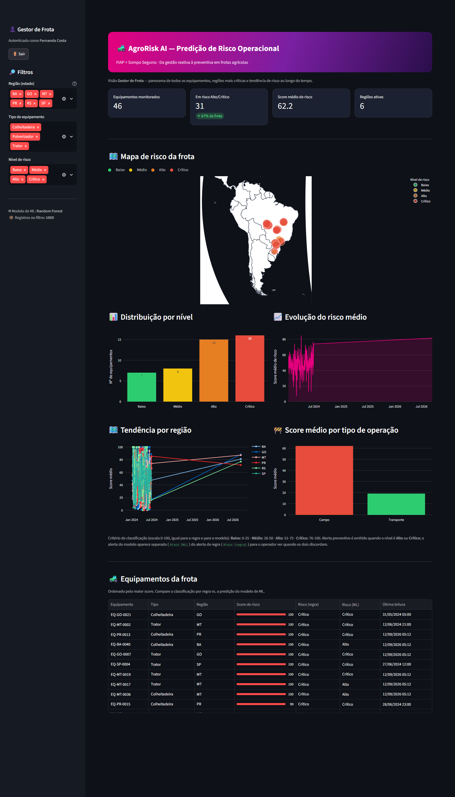
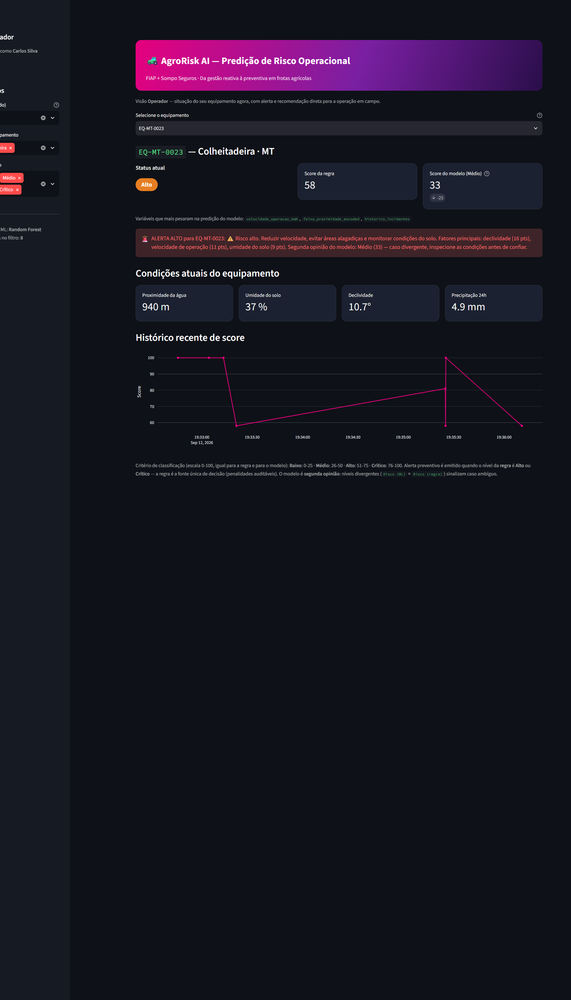
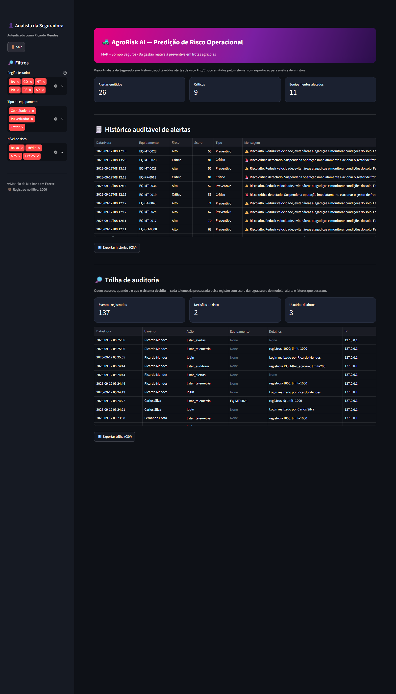

# 🚜 AgroRisk AI — FIAP + Sompo Seguros | Fase 6 / Sprint 4

> **MVP funcional integrado para predição de risco operacional em frotas agrícolas.**

---

## 👨‍🎓 Integrantes

| Nome | RM | GitHub |
|------|----|--------|
| Henrique Sanches Silva | RM 570527 | [@HenriqueSanchesSilva](https://github.com/HenriqueSanchesSilva) |
| João Pedro Zavanela Andreu | RM 570231 | [@zjpza](https://github.com/zjpza) |
| Kayck Gabriel Evangelista da Silva | RM 572331 | [@Kayckxz](https://github.com/Kayckxz) |
| Luis Henrique Laurentino Boschi | RM 571352 | [@lhboschi](https://github.com/lhboschi) |
| Patrick Borges de Melo | RM 574030 | [@Trickmelo](https://github.com/Trickmelo) |

**Tutora:** Sabrina Otoni  
**Coordenador:** André Godoi

## 🧩 Responsabilidades por Issue

A divisão de tarefas entre os integrantes foi organizada pelas issues do repositório. Cada módulo teve responsáveis definidos, garantindo cobertura de ponta a ponta:

| Issue | Módulo | Responsáveis |
|-------|--------|--------------|
| [#1](https://github.com/zjpza/fase6-sprint4/issues/1) | Setup — auditoria da base importada e plano de consolidação | Patrick Borges · Kayck Gabriel |
| [#2](https://github.com/zjpza/fase6-sprint4/issues/2) | Arquitetura — modularização e tratamento de exceções | João Pedro · Henrique Sanches |
| [#3](https://github.com/zjpza/fase6-sprint4/issues/3) | ETL / Banco SQLite — inconsistências, faltantes e duplicidades | Luis Henrique · Kayck Gabriel |
| [#4](https://github.com/zjpza/fase6-sprint4/issues/4) | ML — variáveis, métricas e score de risco contínuo | João Pedro · Henrique Sanches |
| [#5](https://github.com/zjpza/fase6-sprint4/issues/5) | Integração — validação da coleta de telemetria | Luis Henrique · Kayck Gabriel |
| [#6](https://github.com/zjpza/fase6-sprint4/issues/6) | Segurança — controle de acesso, proteção de dados e rastreabilidade | João Pedro · Henrique Sanches |
| [#7](https://github.com/zjpza/fase6-sprint4/issues/7) | Dashboard — relatórios por perfil (tendências, alertas, recomendações) | João Pedro · Henrique Sanches |
| [#8](https://github.com/zjpza/fase6-sprint4/issues/8) | MVP — testes e evidências de validação ponta a ponta | Kayck Gabriel · Luis Henrique |
| [#9](https://github.com/zjpza/fase6-sprint4/issues/9) | Entrega final — README, diagrama, vídeo e acesso do tutor | Kayck Gabriel · Luis Henrique |

> O trio de integração central (ML + Backend + Segurança + Dashboard) foi conduzido por João Pedro e Henrique Sanches; a engenharia de dados e a entrega final contaram com Luis Henrique, Kayck Gabriel e Patrick Borges.

---

## 📜 Descrição

O **AgroRisk AI** é um sistema de análise preditiva de risco para equipamentos agrícolas que cruza dados ambientais, operacionais e históricos para gerar alertas preventivos antes que incidentes ocorram.

Nesta **Sprint 4 (Fase 6)**, o objetivo é **consolidar o MVP integrado na Sprint 3 e corrigir as lacunas técnicas apontadas no feedback da tutoria**. As 9 issues do repositório fecham o ciclo: auditoria da base importada, refatoração arquitetural, refinamento do ETL/banco, ajuste do modelo preditivo, validação da integração, consolidação da segurança, relatórios finais do dashboard, testes de ponta a ponta e entrega. O fluxo permanece o da Sprint 3 — telemetria entra, é persistida, pontuada pelo modelo e apresentada por persona — agora com score de risco contínuo, dados íntegros e evidências de validação.

> **Estado atual:** MVP integrado em consolidação para a entrega final. Backend FastAPI com APIs REST, autenticação JWT + bcrypt, RBAC centralizado, auditoria com IP, pipeline ETL determinístico e idempotente (dados sujos descartados com motivo e rastreabilidade até a fonte), modelo Random Forest integrado com **score contínuo** e fatores por contribuição real, simulador de telemetria em fluxo contínuo e dashboard Streamlit com visões por persona. As correções da Sprint 4 estão rastreadas nas issues [#1–#9](https://github.com/zjpza/fase6-sprint4/issues).

---

## 🎯 Objetivos da Sprint 4

1. **Backend integrador** consolidado e modularizado, com tratamento explícito de entradas ausentes, inválidas e fora do padrão.
2. **Engenharia de dados** íntegra: pipelines rastreáveis, sem inconsistências, faltantes ou duplicidades na base.
3. **Integração validada** com as fontes de telemetria, com confiabilidade da coleta comprovada.
4. **Segurança da informação** consolidada: controle de acesso, proteção de dados e rastreabilidade das operações.
5. **Interface e relatórios** finais por perfil, com tendências de risco, alertas e recomendações.
6. **Documentação e evidências**: arquitetura efetivamente entregue, prints das visões, fluxo ponta a ponta demonstrado em vídeo.

---

## 🔄 Evolução do Projeto

| Sprint | Fase | Entrega Principal |
|--------|------|-------------------|
| Sprint 1 | Fase 2 | Planejamento: personas, user stories, dataset simulado (20 registros), arquitetura da solução. |
| Sprint 2 | Fase 4 | Implementação técnica: banco SQLite, ETL, modelo Random Forest treinado, dashboard Streamlit, métricas de avaliação. |
| Sprint 3 | Fase 5 | Integração dos módulos em MVP funcional: backend orquestrador, APIs REST, segurança (JWT + bcrypt + RBAC), simulador de telemetria e fluxo contínuo ponta a ponta. |
| **Sprint 4** | **Fase 6** | **Consolidação do MVP integrado: correções do feedback da tutoria, ETL/banco íntegros, score de risco contínuo com fatores reais, relatórios por perfil, testes de ponta a ponta e entrega documentada.** |

Repositórios anteriores:
- Sprint 1: [challenger-sprint-1](https://github.com/HenriqueSanchesSilva/challenger-sprint-1)
- Sprint 2: [fase-4-challange](https://github.com/zjpza/fase-4-challange)
- Sprint 3: [fase-5-sprint-3](https://github.com/zjpza/fase-5-sprint-3)

---

## 🏗️ Arquitetura da Solução

Fluxo entregue: **coleta → ETL higienizado e rastreável → API → banco → modelo → score/alerta →
dashboard**, com segurança e auditoria atravessando tudo.

```
generate_dataset / simulador  →  feature_engineering  →  validacao_dados  →  load_to_sql
       (coleta)                       (features)          (higienização)     (carga idempotente)
                                                                                  │
                                                                                  ▼
   dashboard  ←  GET com JWT  ←  FastAPI (routes + telemetria_service)  ←→  SQLite (+ auditoria)
       │                              ▲            │
       │                              │            ▼
       └── trilha de auditoria ───────┘      predictor (score contínuo + fatores)
```


> Fonte editável do diagrama: [`assets/diagrama_arquitetura.mmd`](assets/diagrama_arquitetura.mmd)
> (renderize em mermaid.live ou com `mermaid-cli`).

Camadas:
1. **Entrada de dados**: `simulador_telemetria.py` gera registros sintéticos determinísticos (SEED=42) via `gerar_dataset` e envia em fluxo contínuo à API, com retry em falha transitória e resumo da execução; `pipeline_client.py` demonstra o caso simples com um registro.
2. **ETL**: `feature_engineering.py` deriva as features de risco, `validacao_dados.py` higieniza (faltante, duplicado, domínio, faixa, incoerência) e `load_to_sql.py` carrega de forma idempotente, guardando `fonte` + `id_coleta` de cada registro.
3. **Backend orquestrador**: FastAPI que valida entradas (Pydantic), persiste em SQLite via conexão com `busy_timeout`, aciona o modelo preditivo e registra auditoria — inclusive da decisão tomada.
4. **Banco de dados**: SQLite relacional com telemetria (rastreável até a origem), equipamentos, scores_modelo, alertas, usuários (senhas bcrypt) e auditoria, com `CHECK`, `FOREIGN KEY` e gatilho de consistência.
5. **Modelo preditivo**: Random Forest (11 features, revisadas por cross-validation no `train_model.py`) carregado uma vez na inicialização via `lifespan`. Devolve score 0-100 contínuo (média das faixas ponderada pelas probabilidades) e os fatores que pesaram naquele registro — mesma escala do score da regra, então os dois são comparáveis.
6. **Interface**: dashboard Streamlit que consome a API REST via JWT. A visão é derivada do papel do usuário autenticado: Gestor de Frota vê mapa, tendências por região/operação e critérios; Operador vê seu equipamento com score da regra × score do modelo e os fatores; Analista vê o histórico auditável de alertas e a trilha de auditoria, com exportação CSV.
7. **Segurança**: JWT HS256 com expiração validada, senhas bcrypt, RBAC centralizado em `rbac.py`, validação de entradas, triggers SQL de integridade e trilha de auditoria consultável.

---

## 📁 Estrutura de Pastas

```
fase6-sprint4/
├── README.md                          # Este arquivo
├── start_api.py                        # Ponto de entrada da API (adiciona src/ ao PYTHONPATH)
├── requirements.txt                    # Dependências Python
├── .env.example                        # Template de variáveis de ambiente (JWT_SECRET_KEY)
├── .gitignore
├── sompo.db                            # Banco SQLite (NÃO versionado — gerado pelo ETL, ver Como Executar)
├── src/                               # Código fonte
│   ├── api/                           # Backend integrador (FastAPI)
│   │   ├── main.py                    # App FastAPI + lifespan (carrega predictor singleton)
│   │   ├── routes.py                  # Endpoints REST: login, telemetria, equipamentos, alertas
│   │   ├── schemas.py                 # Modelos Pydantic (TelemetriaInput, TokenResponse, etc.)
│   │   ├── database.py                # Conexão SQLite (data.conexao) para a API
│   │   ├── telemetria_service.py      # Orquestra: features → score → persistência → predição → alerta
│   │   ├── pipeline_client.py         # Cliente demo: login + 1 telemetria + alertas
│   │   └── simulador_telemetria.py    # Simulador de fluxo contínuo (argparse CLI)
│   ├── data/                          # ETL e pipelines (pacote: importável como data.*)
│   │   ├── __init__.py               # Docstring do pacote ETL
│   │   ├── conexao.py                 # Conexão SQLite compartilhada (FKs + busy_timeout)
│   │   ├── generate_dataset.py        # Gera dataset sintético determinístico (SEED=42)
│   │   ├── feature_engineering.py     # Features derivadas + scaler + validação (ValueError descritivo)
│   │   ├── validacao_dados.py         # Higienização: faltantes, duplicidades, domínios e faixas
│   │   ├── load_to_sql.py             # Carga idempotente em telemetria (rastreabilidade fonte/id_coleta)
│   │   ├── pipeline.py               # Orquestrador ETL: schema → dados → features → banco
│   │   ├── scaler.pkl                 # MinMaxScaler (gerado pelo ETL, não versionado)
│   │   └── label_encoders.pkl         # LabelEncoders (gerado pelo ETL, não versionado)
│   ├── ml/                            # Modelo preditivo e inferência
│   │   ├── models/
│   │   │   └── risk_model.pkl         # Random Forest serializado (Sprint 2)
│   │   ├── predictor.py               # RiskPredictor: carrega modelo, prediz, extrai fatores
│   │   ├── recomendacao.py            # Recomendações textuais por nível de risco
│   │   ├── 01_eda.ipynb               # Análise exploratória
│   │   ├── 02_modelagem.ipynb         # Treinamento do modelo
│   │   ├── 03_avaliacao.ipynb         # Avaliação e métricas
│   │   ├── 04_predict.py              # Script de predição standalone
│   │   ├── train_model.py             # Treino + avaliação + relatório de métricas (Sprint 4)
│   │   └── relatorio_metricas.md      # Relatório de métricas do modelo final
│   ├── sql/                           # Schema, views, triggers e seeds
│   │   ├── 01_schema.sql              # Tabelas: equipamentos, telemetria, scores, alertas, usuarios
│   │   ├── 02_seed_data.sql           # Seeds: equipamentos demo, usuários com hashes bcrypt
│   │   ├── 03_views.sql               # Views analíticas
│   │   ├── 04_queries_analiticas.sql  # Queries de exploração
│   │   └── 05_audit_schema.sql        # Tabela de auditoria
│   ├── security/                      # Autenticação, autorização e auditoria
│   │   ├── auth.py                    # JWT + bcrypt, authenticate(), get_current_user()
│   │   ├── rbac.py                    # require_role(), require_operador_or_gestor(), etc.
│   │   └── audit_logger.py            # log() para tabela de auditoria
│   └── dashboard/                     # Interface (Streamlit) — consome a API via JWT
│       └── app.py                    # Login JWT + 3 visões por persona (papel do token)
├── tests/                             # Suite pytest (fixtures, testes unitários, API e ETL)
│   ├── conftest.py                   # Fixtures: banco SQLite temporário + TestClient
│   ├── test_unit.py                  # Funções puras (faixa, score, features)
│   ├── test_api.py                   # Endpoints: login, RBAC, telemetria, auditoria
│   ├── test_etl.py                   # ETL: idempotência, higienização e rastreabilidade
│   └── test_e2e.py                    # Fluxo completo: ETL → API → score → alerta → auditoria
├── docs/                              # Documentação técnica
│   ├── auditoria-sprint4.md          # Diagnóstico da base importada (issue #1)
│   ├── etl-consistencia.md           # Evidências de consistência do ETL (issue #3)
│   ├── ml-score-e-fatores.md         # Score contínuo e fatores do modelo (issue #4)
│   ├── integracao-coleta.md          # Confiabilidade da coleta de telemetria (issue #5)
│   ├── seguranca-auditoria.md        # Segredo, tokens e trilha de auditoria (issue #6)
│   ├── dashboard-relatorios.md       # Critérios, personas e prints das visões (issue #7)
│   ├── evidencias-mvp.md             # Suite, execução demonstrativa e User Stories (issue #8)
│   └── roteiro-video.md              # Roteiro cena a cena do vídeo de entrega (issue #9)
└── assets/                            # Diagrama de arquitetura e prints das telas
    ├── diagrama_arquitetura.mmd      # Fonte Mermaid editável
    ├── diagrama_arquitetura.png      # Imagem renderizada
    └── prints/                       # Capturas das 3 visões do dashboard (issue #7)
```

---

## ⚙️ Tecnologias Utilizadas

| Camada | Tecnologia | Justificativa |
|--------|-----------|---------------|
| Backend | Python + FastAPI | Leve, rápido e com documentação automática das APIs |
| Banco de dados | SQLite | Prototipação rápida, rastreabilidade e zero configuração |
| ETL | Pandas, NumPy | Manipulação e validação de dados tabulares |
| Machine Learning | Scikit-learn | Reutilização do modelo Random Forest treinado |
| Dashboard | Streamlit + Plotly | Interface simples e rápida para MVP |
| Segurança | PyJWT, passlib[bcrypt] | Autenticação JWT, senhas com hash bcrypt e RBAC |
| Cliente HTTP | httpx | Cliente síncrono para pipeline_client e simulador |

---

## 🚀 Como Executar

### Pré-requisitos

- Python 3.10+
- pip

### Instalação

```bash
# Clone o repositório
git clone https://github.com/zjpza/fase6-sprint4.git
cd fase6-sprint4

# Crie um ambiente virtual (recomendado)
python -m venv venv
source venv/bin/activate  # Linux/Mac
# ou
venv\Scripts\activate     # Windows

# Instale as dependências
pip install -r requirements.txt
```

### Variáveis de ambiente (opcional)

Sem `JWT_SECRET_KEY`, a API gera um **segredo aleatório por processo** (tokens deixam de valer
ao reiniciar) — não existe segredo embutido no código. Para tokens estáveis, crie um `.env` a
partir do `.env.example`:

```bash
python -c "import secrets; print(secrets.token_urlsafe(32))"   # gere o segredo
cp .env.example .env                                            # e cole o valor em JWT_SECRET_KEY
```

Ou defina direto no ambiente antes de iniciar a API:

```bash
# Linux/Mac
export JWT_SECRET_KEY="sua-chave-secreta-de-32-bytes"

# Windows (PowerShell)
$env:JWT_SECRET_KEY = "sua-chave-secreta-de-32-bytes"

# Windows (CMD)
set JWT_SECRET_KEY=sua-chave-secreta-de-32-bytes
```

Veja `.env.example` para referência.

O dashboard Streamlit consome a API em `http://127.0.0.1:8000/api/v1` por padrão. Para apontar para outra URL, defina `DASHBOARD_API_URL`:

```bash
export DASHBOARD_API_URL="http://meu-servidor:8000/api/v1"  # Linux/Mac
set DASHBOARD_API_URL=http://meu-servidor:8000/api/v1       # Windows (CMD)
```

### Executar o fluxo ponta a ponta

```bash
# 1. Regenerar o banco de dados e os dados iniciais (sompo.db NÃO vem no repositório)
python src/data/pipeline.py
# → esperado: "[OK] Pipeline concluído com sucesso (997 registros em telemetria)."
#    A carga é idempotente: rodar de novo insere 0 e informa "997 já presentes".
#    Linhas faltantes, duplicadas ou fora de faixa são descartadas com motivo
#    (ver docs/etl-consistencia.md).

# 2. Iniciar o backend (API)
python -m uvicorn start_api:app --host 127.0.0.1 --port 8000
# → esperado: "Application startup complete" (lifespan carrega o predictor uma vez)

# 3. Em outro terminal, enviar telemetria em fluxo contínuo
python src/api/simulador_telemetria.py --n 10 --interval 1
# → esperado: 10 linhas "EQ-... -> score (nivel) | predito (nivel) | alerta SIM/NÃO"

#    Ou enviar um único registro (demo rápida)
python src/api/pipeline_client.py

# 4. Iniciar o dashboard
streamlit run src/dashboard/app.py
```

### Retreinar o modelo (opcional)

O `risk_model.pkl` versionado é o modelo final da Sprint 4 (11 features, acurácia 0.835 e AUC 0.965
no teste). Para reproduzir o treino sobre o dataset tratado pelo ETL:

```bash
python src/ml/train_model.py
# → reescreve src/ml/models/risk_model.pkl e src/ml/relatorio_metricas.md
# Em caminhos com acento, se o cross-validation falhar no joblib: defina JOBLIB_TEMP_FOLDER=C:/joblib_tmp
```

### Simulador de telemetria

O `simulador_telemetria.py` envia registros de telemetria sintéticos em fluxo contínuo:

```bash
python src/api/simulador_telemetria.py [opções]

# Opções:
#   --base-url     URL base da API (default: http://127.0.0.1:8000/api/v1; aceita com ou sem /api/v1)
#   --n            Número de registros a enviar (default: 20)
#   --interval     Intervalo entre envios em segundos (default: 2.0)
#   --role         Papel para autenticação: operador ou gestor (default: gestor)
#   --equipamento  Envia como se fosse deste equipamento (use com --role operador)
#   --lote         Lote de coleta: muda para reenviar as mesmas medições como coleta nova
```

O simulador reenvia cada registro até 3 vezes em falha transitória (timeout, conexão, 5xx),
renova o token no 401 e termina com um resumo (`enviados | aceitos | já registrados | rejeitados |
falhas`), retornando código 1 se algo não entrou. Sem `--lote`, reexecutar o mesmo comando é
idempotente: as coletas já registradas voltam como 409 e nada é duplicado.

Fluxo: POST `/login` → token JWT → POST `/telemetria` por registro → imprime score, nível, predição e alerta. Em caso de token expirado (401), re-autentica e tenta novamente.

### Endpoints da API

| Método | Endpoint | Descrição | Autenticação |
|--------|----------|-----------|--------------|
| GET | `/health` | Status do serviço | Pública |
| POST | `/api/v1/login` | Autenticação JWT (email + senha) | Pública |
| GET | `/api/v1/me` | Usuário autenticado a partir do token JWT | JWT |
| POST | `/api/v1/telemetria` | Recebe telemetria, calcula score, prediz e registra alerta | JWT (Operador ou Gestor) |
| GET | `/api/v1/equipamentos` | Lista frota completa | JWT |
| GET | `/api/v1/equipamentos/{id}/risco` | Risco atual do equipamento | JWT |
| GET | `/api/v1/alertas` | Alertas recentes (filtrado por equipamento para Operador) | JWT |
| GET | `/api/v1/auditoria` | Trilha de auditoria com decisões do sistema (`limit` 1-1000, filtro por `acao`) | JWT (Gestor/Analista) |
| GET | `/api/v1/telemetria` | Histórico de telemetria com predições e fatores do modelo (filtrado por equipamento para Operador; `limit` 1-1000) | JWT |
| GET | `/api/v1/resumo-frota` | Resumo de risco por equipamento (view `vw_resumo_risco_equipamento`) | JWT |

Usuários de demonstração (senhas armazenadas como hash bcrypt no banco):

| Email | Senha | Papel | Equipamento |
|-------|-------|-------|-------------|
| `carlos@agrorisk.local` | `operador123` | Operador | EQ-MT-0023 |
| `fernanda@agrorisk.local` | `gestor123` | Gestor de Frota | — |
| `ricardo@sompo.local` | `analista123` | Analista da Seguradora | — |

---

### Dashboard (Streamlit)

O dashboard consome a API REST autenticada via JWT — não lê o banco diretamente.

1. Ao abrir, exibe tela de login (email + senha) no sidebar.
2. Após autenticar, o papel do usuário (Operador, GestorFrota ou AnalistaSeguradora) determina a visão exibida — não há seleção manual de persona.
3. Todos os dados (telemetria, equipamentos, alertas) são carregados via chamadas `GET` à API com header `Authorization: Bearer <token>`.
4. O endpoint `GET /api/v1/telemetria` filtra automaticamente por equipamento quando o usuário é Operador.

| Visão | Papel | Conteúdo |
|-------|-------|---------|
| Gestor de Frota | `GestorFrota` | Mapa de risco da frota, distribuição por nível, evolução temporal, tabela de equipamentos |
| Operador | `Operador` | Status do equipamento próprio, alerta visual, condições atuais, histórico de score |
| Analista da Seguradora | `AnalistaSeguradora` | Histórico auditável de alertas Alto/Crítico com exportação CSV |

### Testes automatizados

A suite pytest (80 casos) cobre funções puras, endpoints com RBAC, ETL e o fluxo completo — resumo em [`docs/evidencias-mvp.md`](docs/evidencias-mvp.md):

```bash
# Com o venv ativado
python -m pytest tests/ -v
```

| Arquivo | Cobertura |
|---------|-----------|
| `tests/conftest.py` | Fixtures: banco SQLite temporário por teste, override de `get_db`, `TestClient` com `RiskPredictor` |
| `tests/test_unit.py` (23) | `faixa_proximidade`, `classificar_risco`, `score_regra`, `score_continuo` (ponderado pelas probabilidades), `_calcular_features`, **`componentes_regra` (soma o score da regra e ordena as penalidades reais)**, **`mensagem_alerta` (penalidades + segunda opinião do modelo)**, inferência do modelo (fatores por contribuição e continuidade do score) |
| `tests/test_api.py` (38) | Login (200/401), `/me`, POST `/telemetria` (201/401/403/409/422), RBAC por papel, coleta reenviada sem duplicar, rajada com consistência de totais, payload malformado sem gravação parcial, token expirado/forjado, injeção no identificador, GET `/telemetria` com filtragem e validação de `limit`, `/auditoria` com RBAC e filtro por ação, **alerta do histórico segue a regra mesmo divergindo**, `/equipamentos`, `/alertas`, `/health` |
| `tests/test_etl.py` (16) | Carga idempotente (recarga não duplica nem insere 0), higienização por motivo (faltante, duplicado, domínio, faixa, incoerência), rastreabilidade `fonte`/`id_coleta`, migração de base legada |
| `tests/test_e2e.py` (3) | Fluxo completo em diretório temporário: ETL → API contra o banco gerado → score → **alerta da regra persistido no histórico com nível/score/mensagem** → auditoria, e recarga do ETL sem duplicar |

Os testes usam `TestClient` (FastAPI) em processo — não exigem API rodando. O banco é recriado em arquivo temporário a cada teste, garantindo isolamento.

---

## 🛡️ Segurança

- **Autenticação**: JWT (HS256) com expiração de 60 minutos. Senhas armazenadas como hash bcrypt na tabela `usuarios` (nunca em texto puro). Secret do JWT configurável via variável de ambiente `JWT_SECRET_KEY`.
- **Autorização (RBAC)**: papéis `Operador`, `GestorFrota` e `AnalistaSeguradora` com verificações centralizadas em `src/security/rbac.py`. O endpoint `POST /telemetria` exige `Operador` ou `GestorFrota`; `AnalistaSeguradora` recebe 403. Operadores só podem enviar telemetria para seu próprio equipamento.
- **Integridade**: triggers SQL garantem consistência entre `nivel_risco` e `alerta_gerado`; `CHECK` constraints validam domínios; `FOREIGN KEY` com `PRAGMA foreign_keys = ON`.
- **Auditoria**: tabela `auditoria` registra chamadas à API (login, telemetria, consultas) **e as decisões do sistema** (`decisao_risco` com score da regra, score do modelo, alerta e fatores), com usuário, ação, recurso, IP e timestamp. A trilha é consultável por Gestor/Analista em `GET /api/v1/auditoria`.
- **Validação**: modelos Pydantic com `Field(..., ge=, le=, pattern=)` sanitizam e validam entradas antes da persistência.
- **Dashboard**: o dashboard Streamlit exige login JWT para acessar qualquer visão. O papel do usuário autenticado determina a visão exibida (Operador, Gestor ou Analista) — não há seleção manual de persona.
- **Auditoria**: tabela `auditoria` registra chamadas à API (login, telemetria, consultas) **e as decisões do sistema** (`decisao_risco` com score da regra, score do modelo, alerta da regra, divergência regra×modelo e fatores), com usuário, ação, recurso, IP e timestamp. A trilha é consultável por Gestor/Analista em `GET /api/v1/auditoria`.


---

## 🧭 Decisões Técnicas

| Decisão | Por que | Onde está a evidência |
|---|---|---|
| **Repo da sprint 4 nasce da base da sprint 3** (não é recomeço) | Consolidar o MVP, não refazer | commit base `eb399fc` |
| **Rastreabilidade por `fonte` + `id_coleta`** em vez de usar a PK da planilha | A carga colidia com as PKs e inseria 0 registros reportando sucesso (achado B2) | [`docs/etl-consistencia.md`](docs/etl-consistencia.md) |
| **`INSERT` puro, sem `INSERT OR IGNORE`** | O `OR IGNORE` engolia qualquer violação (não só duplicidade) e transformava linha ruim em sucesso silencioso | [`docs/etl-consistencia.md`](docs/etl-consistencia.md) |
| **Higienização antes do consumo**, com motivo por descarte | O modelo precisa de dados íntegros; o descarte precisa ser auditável, não invisível | `src/data/validacao_dados.py` |
| **Score contínuo = esperança das probabilidades**, na mesma escala da regra | O score fixo por classe nivelava registros diferentes; manter a mesma escala torna regra × modelo comparáveis | [`docs/ml-score-e-fatores.md`](docs/ml-score-e-fatores.md) |
| **Fatores por perturbação local**, não SHAP | Mede a contribuição real no registro; SHAP adicionaria dependência pesada sem mudar a decisão do operador | `src/ml/predictor.py`, testes em `tests/test_unit.py` |
| **Retreino com revisão de features por cross-validation** | Cortar variáveis redundantes com número, não com intuição (11 features vs 13) | [`src/ml/relatorio_metricas.md`](src/ml/relatorio_metricas.md) |
| **Retry com backoff no coletor e 409 para coleta repetida** | Coleta de campo tem falha de rede e reenvio; nada pode entrar sem score ou duplicado | [`docs/integracao-coleta.md`](docs/integracao-coleta.md) |
| **Segredo JWT por env com fallback efêmero** (nada de constante no código) | Eliminar credencial versionada (achado B10) sem impedir a demonstração | [`docs/seguranca-auditoria.md`](docs/seguranca-auditoria.md) |
| **Regra decide o alerta; modelo = segunda opinião** | Uma fonte única de decisão impede alerta na tela sem registro na trilha (e vice-versa); divergência vira sinal de caso ambíguo | [`docs/ml-score-e-fatores.md`](docs/ml-score-e-fatores.md) |
| **Auditoria registra decisão, não só acesso** | A pergunta de auditoria é "o que o sistema decidiu e por quê", não apenas "quem entrou" | `GET /api/v1/auditoria` |
| **Mapa com `scatter_geo`** em vez de tiles de rua | Tiles externos + WebGL deixavam o mapa em branco em print/navegador sem WebGL | [`docs/dashboard-relatorios.md`](docs/dashboard-relatorios.md) |
| **`sompo.db` fora do versionamento** | Banco é artefato gerado; o ETL é o passo reproduzível | [`docs/evidencias-mvp.md`](docs/evidencias-mvp.md) |

---

## 📊 User Stories Atendidas

| ID | Persona | User Story | Como o MVP atende | Evidência |
|----|---------|-----------|-------------------|-----------|
| US-01 | Operador | Receber alerta visual antes de entrar em área de alto risco. | Alerta na tela com nível, score da regra × score do modelo e **fatores que pesaram**, gerado no POST e persistido na tabela `alertas` | `assets/prints/02-operador-campo.png` |
| US-04 | Gestora | Visualizar em mapa o status de risco de cada equipamento. | Mapa com pontos por nível, KPIs da frota e tendências por região/tipo de operação | `assets/prints/01-gestor-frota.png` |
| US-07 | Analista | Acessar histórico de alertas emitidos antes de um sinistro. | Histórico auditável de alertas com CSV + trilha de auditoria das decisões | `assets/prints/03-analista-seguradora.png` |

Detalhamento das evidências por issue: [`docs/evidencias-mvp.md`](docs/evidencias-mvp.md).

---

## 🖼️ Prints das Visões

Capturas das telas finais (dashboard rodando contra a API), com o score contínuo e os fatores
da predição — detalhes e critérios em [`docs/dashboard-relatorios.md`](docs/dashboard-relatorios.md).

| Gestor de Frota | Operador | Analista da Seguradora |
|---|---|---|
|  |  |  |

Para capturar/gravar a demonstração entrando direto com um usuário de demonstração, suba o
dashboard com `DASHBOARD_DEMO_LOGIN=gestor` (ou `operador`/`analista`) — sem a variável, o login
continua sendo o formulário normal.

---

## 🎥 Apresentação em Vídeo

> 🎥 **[Vídeo da Sprint 4 — fluxo integrado ponta a ponta](https://youtu.be/COLE_O_LINK_AQUI)** *(não listado no YouTube)*

Roteiro cena a cena, com os comandos e o que mostrar em cada momento:
[`docs/roteiro-video.md`](docs/roteiro-video.md).

> **Acesso:** o repositório está **público** por decisão do grupo — o link do GitHub fica disponível
> para a tutoria sem convite (o enunciado prevê o link direto nesse caso).

---

## ✅ Checklist da Entrega

| Item | Situação |
|---|---|
| MVP integrado rodando ponta a ponta (issues #1-#8) | ✅ fechado, com evidências em `docs/` |
| Prints das três visões em `assets/prints/` | ✅ versão final capturada do dashboard rodando |
| Diagrama de arquitetura da solução entregue | ✅ `assets/diagrama_arquitetura.png` (fonte `.mmd`) |
| README consolidado com decisões e evidências | ✅ este arquivo + `docs/` |
| Suite de testes verde | ✅ `python -m pytest tests/ -q` → 76 passed |
| Vídeo (≤5 min, não listado, fluxo na tela) | ⏳ gravar e publicar seguindo `docs/roteiro-video.md`; colar o link em **Apresentação em Vídeo** |
| Repositório para a tutoria | ✅ público (link direto) — decisão do grupo |

---

## 📋 Licença

Este projeto é desenvolvido para fins acadêmicos no Challenge Sprint FIAP + Sompo Seguros.

---

> **FIAP — Inteligência Artificial | Turma: 1TIAOB-2026**