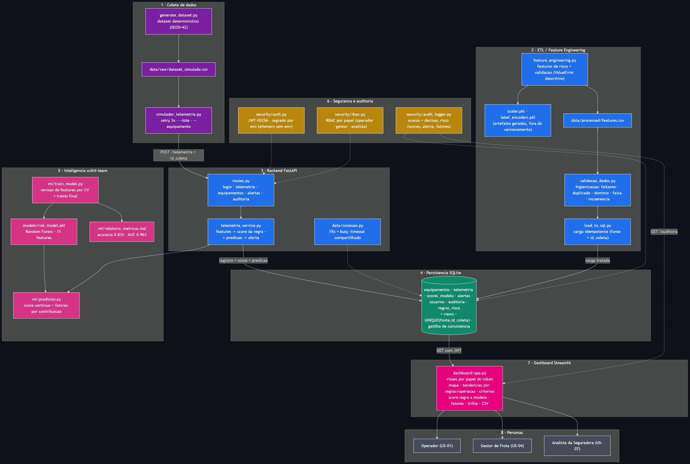

# 🚜 AgroRisk AI — FIAP + Sompo Seguros | Fase 5 / Sprint 3

> **MVP funcional integrado para predição de risco operacional em frotas agrícolas.**

---

## 👨‍🎓 Integrantes

| Nome | RM | GitHub |
|------|----|--------|
| Henrique Sanches Silva | RM 570527 | [@HenriqueSanchesSilva](https://github.com/HenriqueSanchesSilva) |
| João Pedro Zavanela Andreu | RM 570231 | [@zjpza](https://github.com/zjpza) |
| Kayck Gabriel Evangelista da Silva | RM 572331 | [@Kayckxz](https://github.com/Kayckxz) |
| Luis Henrique Laurentino Boschi | RM 571352 | [@lhboschi](https://github.com/lhboschi) |
| Patrick Borges de Melo | RM 574030 | [@Trickmelo](https://github.com/Trickmelo) |

**Tutora:** Sabrina Otoni  
**Coordenador:** André Godoi

## 🧩 Responsabilidades por Issue

A divisão de tarefas entre os integrantes foi organizada pelas issues do repositório. Cada módulo teve responsáveis definidos, garantindo cobertura de ponta a ponta:

| Issue | Módulo | Responsáveis |
|-------|--------|--------------|
| [#7](https://github.com/zjpza/fase-5-sprint-3/issues/7) | Setup — importação da base da Sprint 2 | Patrick Borges · Kayck Gabriel |
| [#3](https://github.com/zjpza/fase-5-sprint-3/issues/3) | ETL / Banco SQLite + pipelines | Luis Henrique · Kayck Gabriel |
| [#6](https://github.com/zjpza/fase-5-sprint-3/issues/6) | ML — integração do modelo Random Forest | João Pedro · Henrique Sanches |
| [#2](https://github.com/zjpza/fase-5-sprint-3/issues/2) | Backend — API integradora FastAPI | João Pedro · Henrique Sanches |
| [#5](https://github.com/zjpza/fase-5-sprint-3/issues/5) | Segurança — JWT, RBAC e auditoria | João Pedro · Henrique Sanches |
| — | Dashboard Streamlit (3 visões por persona) | João Pedro · Henrique Sanches |
| [#8](https://github.com/zjpza/fase-5-sprint-3/issues/8) | Entrega final — screenshots, doc de fluxo, vídeo e acesso do tutor | Kayck Gabriel · Luis Henrique |

> O trio de integração central (ML + Backend + Segurança + Dashboard) foi conduzido por João Pedro e Henrique Sanches; a engenharia de dados e a entrega final contaram com Luis Henrique, Kayck Gabriel e Patrick Borges.

---

## 📜 Descrição

O **AgroRisk AI** é um sistema de análise preditiva de risco para equipamentos agrícolas que cruza dados ambientais, operacionais e históricos para gerar alertas preventivos antes que incidentes ocorram.

Nesta **Sprint 3 (Fase 5)**, o objetivo é **integrar os módulos desenvolvidos nas Sprints anteriores em um protótipo funcional de ponta a ponta**. Os dados de telemetria entram no sistema, são persistidos em banco, processados pelo modelo de Machine Learning treinado na Sprint 2 e apresentados em uma interface simples para Operadores, Gestores de Frota e Analistas da Seguradora.

> **Estado atual:** MVP funcional integrado com ~60% da solução em funcionamento. Backend FastAPI com APIs REST, autenticação JWT + bcrypt, RBAC centralizado, auditoria, pipeline ETL determinístico, modelo Random Forest integrado, simulador de telemetria em fluxo contínuo e dashboard Streamlit com visões por persona.

---

## 🎯 Objetivos da Sprint 3

1. **Backend integrador** em Python que orquestra o fluxo completo: entrada → banco → modelo → saída.
2. **Engenharia de dados** consolidada, com banco relacional e pipelines de ETL rastreáveis.
3. **Integração com fontes** de telemetria, ambiente e operação (simuladas ou reais).
4. **Segurança da informação**: controle de acesso, proteção das APIs/serviços e integridade dos dados.
5. **Interface simples** (dashboard em Python) exibindo scores e alertas de forma clara.
6. **Documentação** com arquitetura integrada, fluxo de dados e justificativas técnicas.

---

## 🔄 Evolução do Projeto

| Sprint | Fase | Entrega Principal |
|--------|------|-------------------|
| Sprint 1 | Fase 2 | Planejamento: personas, user stories, dataset simulado (20 registros), arquitetura da solução. |
| Sprint 2 | Fase 4 | Implementação técnica: banco SQLite, ETL, modelo Random Forest treinado, dashboard Streamlit, métricas de avaliação. |
| **Sprint 3** | **Fase 5** | **Integração dos módulos em MVP funcional (~60%): backend orquestrador, APIs REST, segurança (JWT + bcrypt + RBAC), simulador de telemetria e fluxo contínuo ponta a ponta.** |

Repositórios anteriores:
- Sprint 1: [challenger-sprint-1](https://github.com/HenriqueSanchesSilva/challenger-sprint-1)
- Sprint 2: [fase-4-challange](https://github.com/zjpza/fase-4-challange)

---

## 🏗️ Arquitetura da Solução

O pipeline integrado desta Sprint segue o fluxo:

```
┌─────────────────┐     ┌──────────────────┐     ┌─────────────┐     ┌─────────────────┐
│ Fontes de Dados  │────▶│  Backend Python  │────▶│  Modelo ML  │     │  Dashboard /    │
│ (simulador ou   │     │  (FastAPI +      │     │  Random     │────▶│  Relatório     │
│  pipeline_client)│     │  segurança JWT) │     │  Forest     │     │  (Streamlit)   │
└─────────────────┘     └──────────────────┘     └─────────────┘     └─────────────────┘
                                │                        ▲                  │
                                ▼                        │                  │
                        ┌───────────────┐               │                  │
                        │ Banco SQLite  │               └──────────────────┘
                        │ + Auditoria   │     GET /telemetria, /alertas, /equipamentos
                        └───────────────┘                  (JWT Bearer)
```



Camadas:
1. **Entrada de dados**: `simulador_telemetria.py` gera registros sintéticos determinísticos (SEED=42) via `gerar_dataset` e envia em fluxo contínuo à API; `pipeline_client.py` demonstra o caso simples com um registro.
2. **Backend orquestrador**: FastAPI que valida entradas (Pydantic), persiste em SQLite, aciona o modelo preditivo e registra auditoria.
3. **Banco de dados**: SQLite relacional com tabelas de telemetria, equipamentos, scores_modelo, alertas, usuários (senhas bcrypt) e auditoria.
4. **Modelo preditivo**: Random Forest treinado na Sprint 2, carregado uma vez na inicialização via `lifespan` (singleton) e reutilizado em todas as requisições.
5. **Interface**: dashboard Streamlit que consome a API REST via JWT (login obrigatório). A visão é derivada do papel do usuário autenticado: Gestor de Frota vê mapa e frota completa, Operador vê apenas seu equipamento, Analista vê histórico auditável de alertas com exportação CSV.
6. **Segurança**: autenticação JWT com senhas bcrypt, RBAC centralizado em `rbac.py`, validação de entradas, triggers SQL de integridade e logs de auditoria.

---

## 📁 Estrutura de Pastas

```
fase6-sprint4/
├── README.md                          # Este arquivo
├── start_api.py                        # Ponto de entrada da API (adiciona src/ ao PYTHONPATH)
├── requirements.txt                    # Dependências Python
├── .env.example                        # Template de variáveis de ambiente (JWT_SECRET_KEY)
├── .gitignore
├── sompo.db                            # Banco SQLite populado (gerado pelo pipeline)
├── src/                               # Código fonte
│   ├── api/                           # Backend integrador (FastAPI)
│   │   ├── main.py                    # App FastAPI + lifespan (carrega predictor singleton)
│   │   ├── routes.py                  # Endpoints REST: login, telemetria, equipamentos, alertas
│   │   ├── schemas.py                 # Modelos Pydantic (TelemetriaInput, TokenResponse, etc.)
│   │   ├── database.py                # Conexão SQLite com row_factory e foreign_keys
│   │   ├── telemetria_service.py      # Orquestra: features → score → persistência → predição → alerta
│   │   ├── pipeline_client.py         # Cliente demo: login + 1 telemetria + alertas
│   │   └── simulador_telemetria.py    # Simulador de fluxo contínuo (argparse CLI)
│   ├── data/                          # ETL e pipelines (pacote: importável como data.*)
│   │   ├── __init__.py               # Docstring do pacote ETL
│   │   ├── generate_dataset.py        # Gera dataset sintético determinístico (SEED=42)
│   │   ├── feature_engineering.py     # Features derivadas + scaler + validação (ValueError descritivo)
│   │   ├── load_to_sql.py             # Carrega features.csv no banco SQLite
│   │   ├── pipeline.py               # Orquestrador ETL: schema → dados → features → banco
│   │   ├── scaler.pkl                 # MinMaxScaler treinado (Sprint 2)
│   │   └── label_encoders.pkl         # LabelEncoders (Sprint 2)
│   ├── ml/                            # Modelo preditivo e inferência
│   │   ├── models/
│   │   │   └── risk_model.pkl         # Random Forest serializado (Sprint 2)
│   │   ├── predictor.py               # RiskPredictor: carrega modelo, prediz, extrai fatores
│   │   ├── recomendacao.py            # Recomendações textuais por nível de risco
│   │   ├── 01_eda.ipynb               # Análise exploratória
│   │   ├── 02_modelagem.ipynb         # Treinamento do modelo
│   │   ├── 03_avaliacao.ipynb         # Avaliação e métricas
│   │   ├── 04_predict.py              # Script de predição standalone
│   │   └── relatorio_metricas.md      # Relatório de métricas do modelo
│   ├── sql/                           # Schema, views, triggers e seeds
│   │   ├── 01_schema.sql              # Tabelas: equipamentos, telemetria, scores, alertas, usuarios
│   │   ├── 02_seed_data.sql           # Seeds: equipamentos demo, usuários com hashes bcrypt
│   │   ├── 03_views.sql               # Views analíticas
│   │   ├── 04_queries_analiticas.sql  # Queries de exploração
│   │   └── 05_audit_schema.sql        # Tabela de auditoria
│   ├── security/                      # Autenticação, autorização e auditoria
│   │   ├── auth.py                    # JWT + bcrypt, authenticate(), get_current_user()
│   │   ├── rbac.py                    # require_role(), require_operador_or_gestor(), etc.
│   │   └── audit_logger.py            # log() para tabela de auditoria
│   └── dashboard/                     # Interface (Streamlit) — consome a API via JWT
│       └── app.py                    # Login JWT + 3 visões por persona (papel do token)
├── tests/                             # Suite pytest (fixtures, testes unitários e de API)
│   ├── conftest.py                   # Fixtures: banco SQLite temporário + TestClient
│   ├── test_unit.py                  # Funções puras (faixa, score, features)
│   └── test_api.py                   # Endpoints: login, RBAC, telemetria
├── docs/                              # Documentação técnica
│   └── auditoria-sprint4.md          # Diagnóstico da base importada (issue #1)
└── assets/                            # Diagrama de arquitetura (Mermaid + PNG)
    ├── diagrama_arquitetura.mmd      # Fonte Mermaid editável
    └── diagrama_arquitetura.png      # Imagem renderizada

---

## ⚙️ Tecnologias Utilizadas

| Camada | Tecnologia | Justificativa |
|--------|-----------|---------------|
| Backend | Python + FastAPI | Leve, rápido e com documentação automática das APIs |
| Banco de dados | SQLite | Prototipação rápida, rastreabilidade e zero configuração |
| ETL | Pandas, NumPy | Manipulação e validação de dados tabulares |
| Machine Learning | Scikit-learn | Reutilização do modelo Random Forest treinado |
| Dashboard | Streamlit + Plotly | Interface simples e rápida para MVP |
| Segurança | PyJWT, passlib[bcrypt] | Autenticação JWT, senhas com hash bcrypt e RBAC |
| Cliente HTTP | httpx | Cliente síncrono para pipeline_client e simulador |

---

## 🚀 Como Executar

### Pré-requisitos

- Python 3.10+
- pip

### Instalação

```bash
# Clone o repositório
git clone https://github.com/zjpza/fase6-sprint4.git
cd fase6-sprint4

# Crie um ambiente virtual (recomendado)
python -m venv venv
source venv/bin/activate  # Linux/Mac
# ou
venv\Scripts\activate     # Windows

# Instale as dependências
pip install -r requirements.txt
```

### Variáveis de ambiente (opcional)

O `JWT_SECRET_KEY` tem um valor padrão de desenvolvimento embutido no código.
Para produção, defina via variável de ambiente antes de iniciar a API:

```bash
# Linux/Mac
export JWT_SECRET_KEY="sua-chave-secreta-de-32-bytes"

# Windows (PowerShell)
$env:JWT_SECRET_KEY = "sua-chave-secreta-de-32-bytes"

# Windows (CMD)
set JWT_SECRET_KEY=sua-chave-secreta-de-32-bytes
```

Veja `.env.example` para referência.

O dashboard Streamlit consome a API em `http://127.0.0.1:8000/api/v1` por padrão. Para apontar para outra URL, defina `DASHBOARD_API_URL`:

```bash
export DASHBOARD_API_URL="http://meu-servidor:8000/api/v1"  # Linux/Mac
set DASHBOARD_API_URL=http://meu-servidor:8000/api/v1       # Windows (CMD)
```

### Executar o fluxo ponta a ponta

```bash
# 1. Regenerar o banco de dados e os dados iniciais
python src/data/pipeline.py
# → esperado: "[OK] Pipeline concluído com sucesso."

# 2. Iniciar o backend (API)
python -m uvicorn start_api:app --host 127.0.0.1 --port 8000
# → esperado: "Application startup complete" (lifespan carrega o predictor uma vez)

# 3. Em outro terminal, enviar telemetria em fluxo contínuo
python src/api/simulador_telemetria.py --n 10 --interval 1
# → esperado: 10 linhas "EQ-... -> score (nivel) | predito (nivel) | alerta SIM/NÃO"

#    Ou enviar um único registro (demo rápida)
python src/api/pipeline_client.py

# 4. Iniciar o dashboard
streamlit run src/dashboard/app.py
```

### Simulador de telemetria

O `simulador_telemetria.py` envia registros de telemetria sintéticos em fluxo contínuo:

```bash
python src/api/simulador_telemetria.py [opções]

# Opções:
#   --base-url   URL base da API (default: http://127.0.0.1:8000/api/v1; aceita com ou sem /api/v1)
#   --n          Número de registros a enviar (default: 20)
#   --interval   Intervalo entre envios em segundos (default: 2.0)
#   --role       Papel para autenticação: operador ou gestor (default: gestor)
```

Fluxo: POST `/login` → token JWT → POST `/telemetria` por registro → imprime score, nível, predição e alerta. Em caso de token expirado (401), re-autentica e tenta novamente.

### Endpoints da API

| Método | Endpoint | Descrição | Autenticação |
|--------|----------|-----------|--------------|
| GET | `/health` | Status do serviço | Pública |
| POST | `/api/v1/login` | Autenticação JWT (email + senha) | Pública |
| GET | `/api/v1/me` | Usuário autenticado a partir do token JWT | JWT |
| POST | `/api/v1/telemetria` | Recebe telemetria, calcula score, prediz e registra alerta | JWT (Operador ou Gestor) |
| GET | `/api/v1/equipamentos` | Lista frota completa | JWT |
| GET | `/api/v1/equipamentos/{id}/risco` | Risco atual do equipamento | JWT |
| GET | `/api/v1/alertas` | Alertas recentes (filtrado por equipamento para Operador) | JWT |
| GET | `/api/v1/telemetria` | Histórico de telemetria com predições (filtrado por equipamento para Operador) | JWT |
| GET | `/api/v1/resumo-frota` | Resumo de risco por equipamento (view `vw_resumo_risco_equipamento`) | JWT |

Usuários de demonstração (senhas armazenadas como hash bcrypt no banco):

| Email | Senha | Papel | Equipamento |
|-------|-------|-------|-------------|
| `carlos@agrorisk.local` | `operador123` | Operador | EQ-MT-0023 |
| `fernanda@agrorisk.local` | `gestor123` | Gestor de Frota | — |
| `ricardo@sompo.local` | `analista123` | Analista da Seguradora | — |

---

### Dashboard (Streamlit)

O dashboard consome a API REST autenticada via JWT — não lê o banco diretamente.

1. Ao abrir, exibe tela de login (email + senha) no sidebar.
2. Após autenticar, o papel do usuário (Operador, GestorFrota ou AnalistaSeguradora) determina a visão exibida — não há seleção manual de persona.
3. Todos os dados (telemetria, equipamentos, alertas) são carregados via chamadas `GET` à API com header `Authorization: Bearer <token>`.
4. O endpoint `GET /api/v1/telemetria` filtra automaticamente por equipamento quando o usuário é Operador.

| Visão | Papel | Conteúdo |
|-------|-------|---------|
| Gestor de Frota | `GestorFrota` | Mapa de risco da frota, distribuição por nível, evolução temporal, tabela de equipamentos |
| Operador | `Operador` | Status do equipamento próprio, alerta visual, condições atuais, histórico de score |
| Analista da Seguradora | `AnalistaSeguradora` | Histórico auditável de alertas Alto/Crítico com exportação CSV |

### Testes automatizados

A suite pytest cobre funções puras (features e score) e endpoints da API com RBAC:

```bash
# Com o venv ativado
python -m pytest tests/ -v
```

| Arquivo | Cobertura |
|---------|-----------|
| `tests/conftest.py` | Fixtures: banco SQLite temporário por teste, override de `get_db`, `TestClient` com `RiskPredictor` |
| `tests/test_unit.py` | `faixa_proximidade`, `classificar_risco`, `score_regra` (alto/baixo), `_calcular_features` (campos derivados) |
| `tests/test_api.py` | Login (200/401), `/me`, POST `/telemetria` (201/401/403), RBAC por papel, GET `/telemetria` com filtragem, `/equipamentos`, `/alertas`, `/health` |

Os testes usam `TestClient` (FastAPI) em processo — não exigem API rodando. O banco é recriado em arquivo temporário a cada teste, garantindo isolamento.

---

## 🛡️ Segurança

- **Autenticação**: JWT (HS256) com expiração de 60 minutos. Senhas armazenadas como hash bcrypt na tabela `usuarios` (nunca em texto puro). Secret do JWT configurável via variável de ambiente `JWT_SECRET_KEY`.
- **Autorização (RBAC)**: papéis `Operador`, `GestorFrota` e `AnalistaSeguradora` com verificações centralizadas em `src/security/rbac.py`. O endpoint `POST /telemetria` exige `Operador` ou `GestorFrota`; `AnalistaSeguradora` recebe 403. Operadores só podem enviar telemetria para seu próprio equipamento.
- **Integridade**: triggers SQL garantem consistência entre `nivel_risco` e `alerta_gerado`; `CHECK` constraints validam domínios; `FOREIGN KEY` com `PRAGMA foreign_keys = ON`.
- **Auditoria**: tabela `auditoria` registra todas as chamadas à API (login, telemetria, consultas) com usuário, ação, recurso, IP e timestamp.
- **Validação**: modelos Pydantic com `Field(..., ge=, le=, pattern=)` sanitizam e validam entradas antes da persistência.
- **Dashboard**: o dashboard Streamlit exige login JWT para acessar qualquer visão. O papel do usuário autenticado determina a visão exibida (Operador, Gestor ou Analista) — não há seleção manual de persona.

---

## 📊 User Stories Atendidas

| ID | Persona | User Story |
|----|---------|-----------|
| US-01 | Operador | Receber alerta visual antes de entrar em área de alto risco. |
| US-04 | Gestora | Visualizar em mapa o status de risco de cada equipamento. |
| US-07 | Analista | Acessar histórico de alertas emitidos antes de um sinistro. |

---

## 🎥 Apresentação em Vídeo

> 🎥 **[Vídeo da Sprint 3 — fluxo integrado ponta a ponta](https://youtu.be/COLE_O_LINK_AQUI)** *(não listado no YouTube)*

---

## 📋 Licença

Este projeto é desenvolvido para fins acadêmicos no Challenge Sprint FIAP + Sompo Seguros.

---

> **FIAP — Inteligência Artificial | Turma: 1TIAOB-2026**